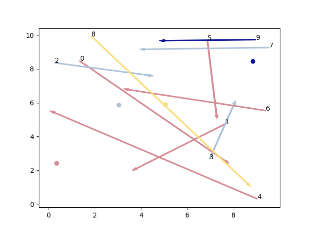
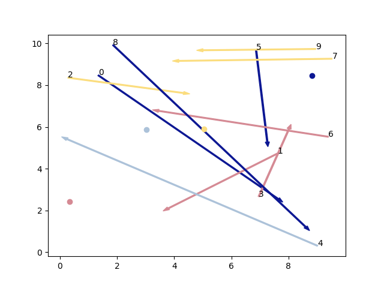
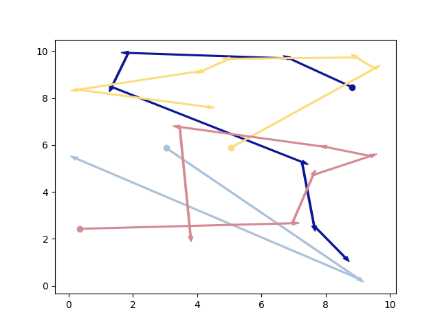
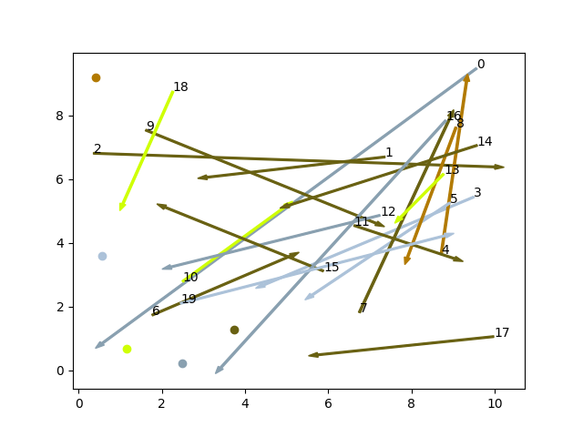
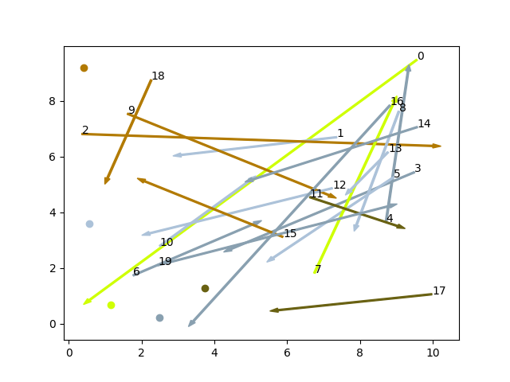
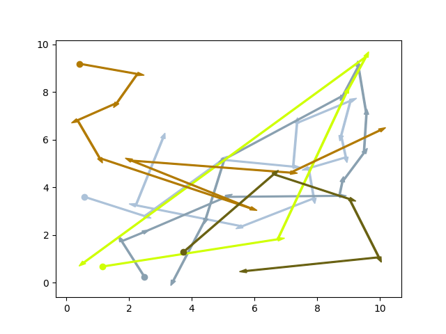
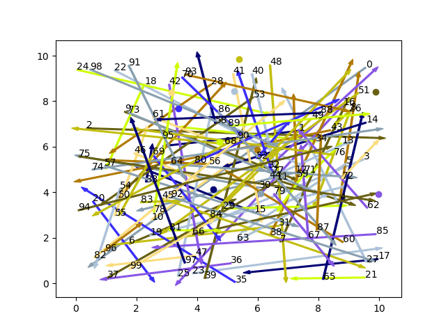
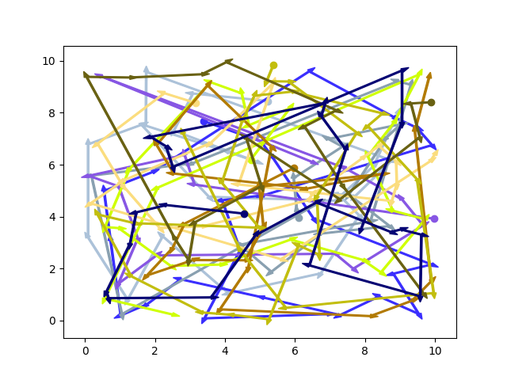

## Задача по сбору и доставке заказов со множеством агентов.
### Описание задачи
Также известная как Pickup and Delivery Problem, описывается следующими условиями: имеется множество заказов, с указанием точек сбора и точек доставки и множество курьеров с указанием их текущего местоположения. Нужно распределить заказы между курьерами и построить маршруты так, чтобы все заказы были выполнены за как можно меньшее время.

Пространство в котором решается задача будет считаться плоскостью в котором из одной точки в другую можно попасть по прямой линии. Стоимость заказа не будет учитываться.

Заказы отображены как стрелки, где конец отображает пункт доставки заказа. Местоположение курьеров отображается в виде круглых точек.
### Алгоритм решения
Задача разделяется на две подзадачи: по распределению заказов между курьерами и затем по нахождению оптимального маршрута в полученных подзадачах.

#### Распределение заказов
Распределение заказов было сделано с помощью алгоритма имитации отжига(Simulated Annealing). Для сравнения полученных решений был использован алгоритм ближайших соседей с прогнозированием на n-шагов. Функция по изменению состояния просто добавляет случайное количество заказов(которое зависит от температуры алгоритма отжига) к случайному курьеру.

Пример работы алгоритма распределения для начальных условий показанных на первом рисунке. Заказы полученные курьером раскрашены в тот же цвет, что и он.

#### Нахождение оптимальных маршрутов
В качестве оптимальных маршрутов были использованы маршруты построенные в процессе распределения заказов алгоритмом ближайших. В идеале нужно было использовать другой более сложный алгоритм вроде эвристического метода Лина-Кернигана(Lin–Kernighan heuristic), но из-за нехватки времени не успел его рассмотреть. Несмотря на это результаты получились довольно хорошими.

## Задача с большим количеством заказов
### Количество заказов: 20, количество курьеров: 5
Время выполнения 1.4990003 секунд.

Максимальная дистанция пройденная одним из курьеров: 24.262335922764635. 

#### Начальная инициализация

#### После распределения заказов

#### После постройки маршрутов

### Количество заказов: 100, количество курьеров: 10
Время выполнения 21.7242584 секунд.

Максимальная дистанция пройденная одним из курьеров: 53.56005368759664.

#### Начальная инициализация

#### После распределения заказов

#### После постройки маршрутов

## Использованная литература
INTRACTABILITY OF THE DIAL-A-RIDE PROBLEM AND A MULTIOBJECTIVE SOLUTION USING SIMULATED ANNEALING, JOHN W. BAUGH JR. a , GOPALA KRISHNA REDDY KAKIVAYA a & JOHN R. STONE a Department of Civil Engineering , North Carolina State University , Raleigh, NC, 27695-7908, U.S.A. Published online: 27 Apr 2007.
